# Appium instalation instructions for Mac OS users

1. homebrew
2. xcode
3. jdk
4. android sdk
5. avd
6. node and npm
7. appium

## 1. homebrew

**homebrew** is a free and open-source software package management system that simplifies the installation of software on Apple's macOS operating system and Linux.

To install *homebrew* just run the following command via terminal prompt:

```	shell
$ /usr/bin/ruby -e "$(curl -fsSL https://raw.githubusercontent.com/Homebrew/install/master/install)"

```

Something similar should be printed out at the end of installation:

```shell
==> Installation successful!

==> Homebrew has enabled anonymous aggregate formulae and cask analytics.
Read the analytics documentation (and how to opt-out) here:
  https://docs.brew.sh/Analytics

==> Homebrew is run entirely by unpaid volunteers. Please consider donating:
  https://github.com/Homebrew/brew#donations
==> Next steps:
- Run `brew help` to get started
- Further documentation: 
    https://docs.brew.sh
   
```

Double check installation:

```shell
$ brew --version
```

Terminal has to respond with:

```bash
Homebrew ~your-homebrew-version~
Homebrew/homebrew-core (git revision 6b334; last commit 2019-05-14)
```

## 2. xcode

**xcode** is an integrated development environment for macOS containing a suite of software development tools developed by Apple for developing software for macOS, iOS, iPadOS, watchOS, and tvOS.

To get *Xcode*, open *App Store*, look for *Xcode*, hit *GET* (check out the screenshot below). I have it already installed, so there is *OPEN* instead of *GET*.

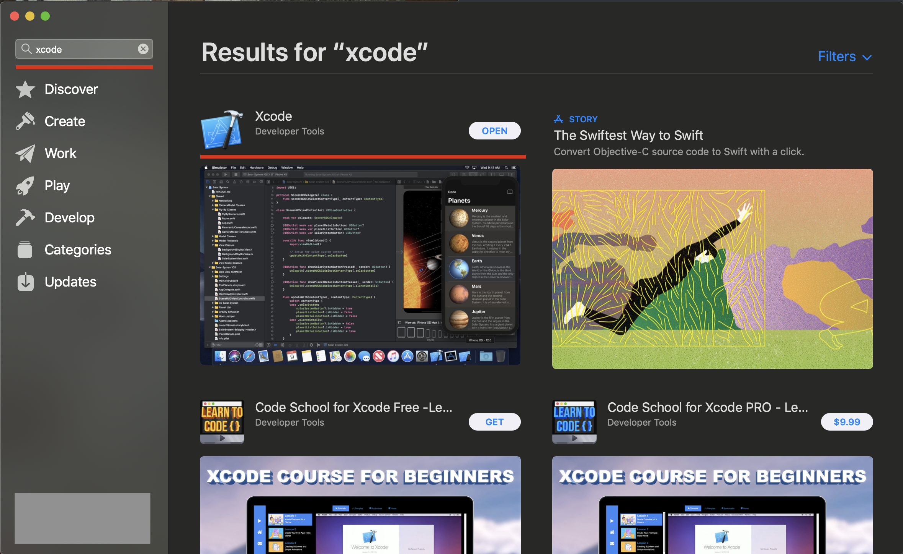

Follow instalation instructions, you should be able to open *Xcode* at after the process:

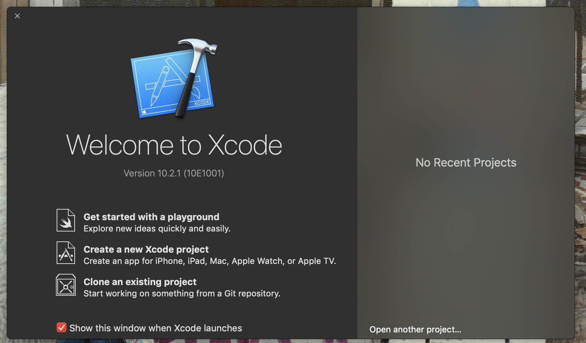

## 3. jdk

The **Java Development Kit** is an implementation of either one of the Java Platform, Standard Edition, Java Platform, Enterprise Edition, or Java Platform, Micro Edition platforms released by Oracle Corporation in the form of a binary product aimed at Java developers on Solaris, Linux, macOS or Windows.

Hopefully, you have already installed JDK, open the terminal and run the command:

```shell
$ java --version
```

You should get something similar to:

```bash
java ~your-java-version~ 2018-07-17
Java(TM) SE Runtime Environment 18.3 (build 10.0.2+13)
Java HotSpot(TM) 64-Bit Server VM 18.3 (build 10.0.2+13, mixed mode)
```

Otherwise, proceed to this [page](https://www.oracle.com/technetwork/java/javase/downloads/jdk8-downloads-2133151.html) and look for a *Mac OS X* distribution, don't forget to accept license agreement! Follow instalation instructions and get `java —version` going. 

## 4. android sdk

Download Android Studio from [here](https://developer.android.com/studio?pkg=studio), might take a while, installer quite bulky. Open installer and follow instalation instructions. Outcome of instalation process should be: 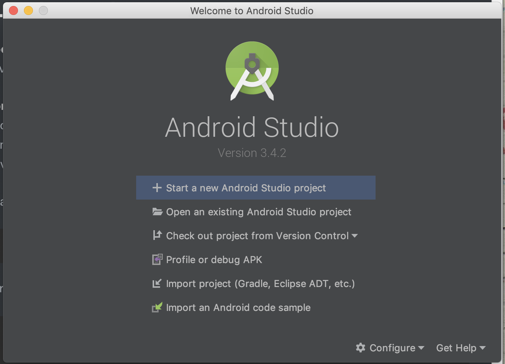

## 5. avd

Open **Android Studio** click on *Configure* and select *AVD Manager*:

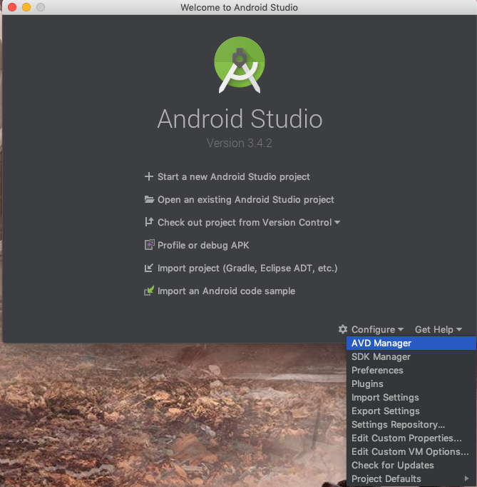

Click at *Create Virtual Device*:

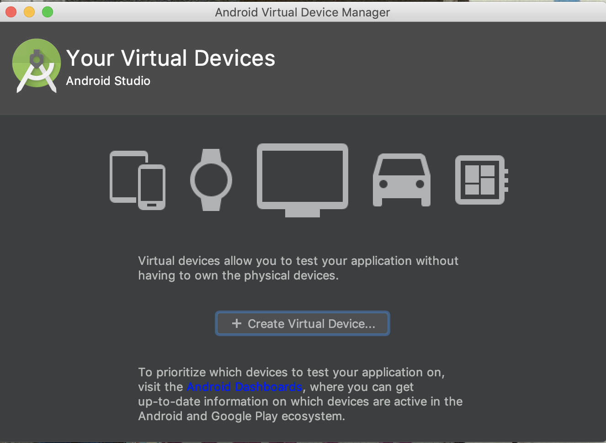

Go with *Pixel 2* and hit *Next*:

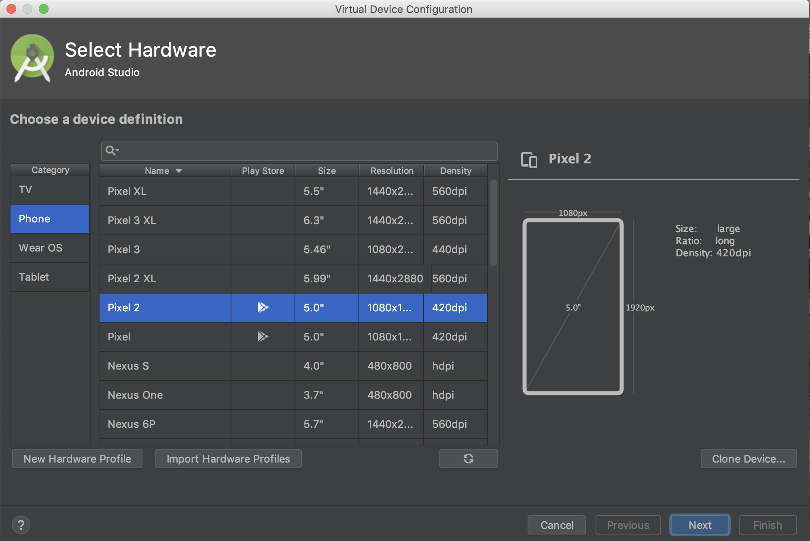

Download Android *Q* os image by clicking at *Download* link and following instalation instructions:

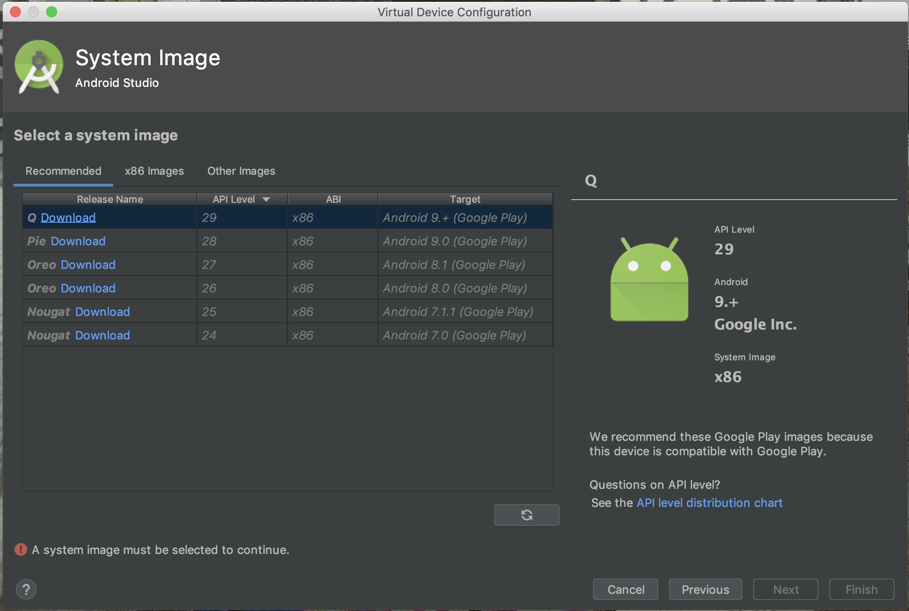

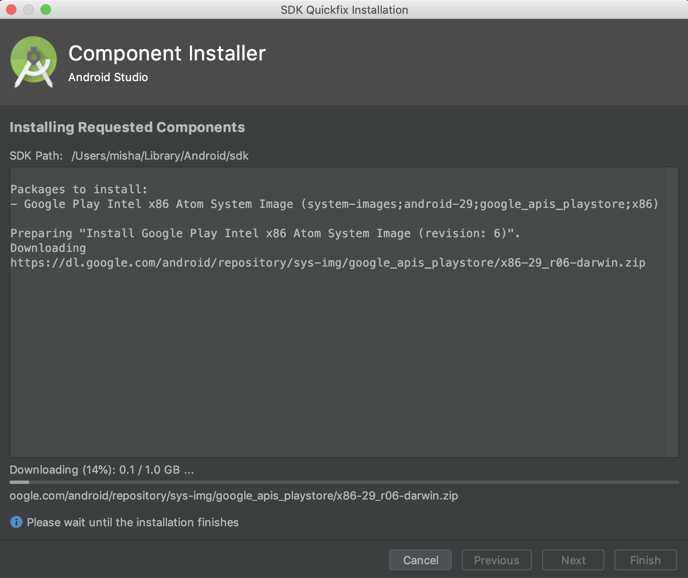

Now it's a time to create an emulator, select Android *Q* os image and hit next:

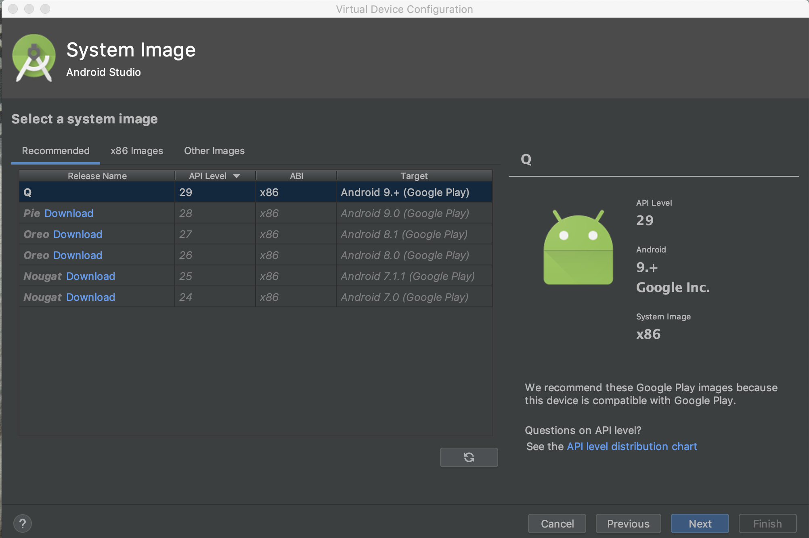

Rename AND so the name doesn't contain spaces and click *Next*:

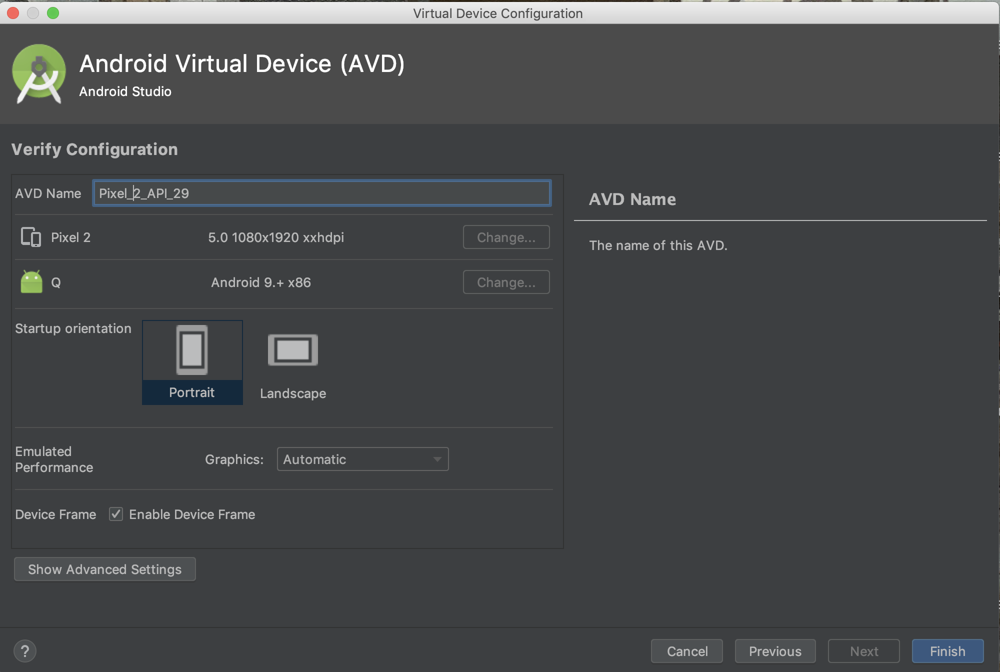

Run emulator by clicking play button:

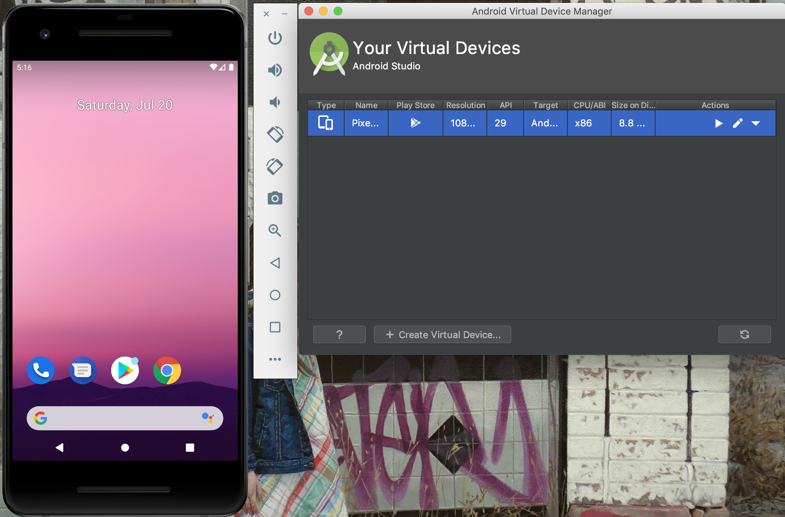

## 6. node.js and npm

**node.js** is an open-source, cross-platform JavaScript run-time environment that executes JavaScript code outside of a browser.

**npm** is a package manager for the JavaScript programming language. It is the default package manager for the JavaScript runtime environment Node.js. It consists of a command line client, also called npm, and an online database of public and paid-for private packages, called the npm registry.

That's a perfect time to try out previously installed **homebrew**:

```shell
$ brew install node
```

Verify instalation with `node -v` and `npm -v`.

```shell
$ node -v
v10.10.0
$ npm -v
6.4.1
```

## 7. appium

**appium** is an open source test automation framework for use with native, [hybrid](http://appium.io/docs/en/writing-running-appium/web/hybrid/) and mobile web apps. It drives iOS, Android, and Windows apps using the WebDriver protocol.

Most probably you won't have writing permissions to `/usr/local/lib/node_modules` (place where npm will attempt to install appium). To fix that you need to figure out name of the current user: 

```shell
$ whoami
```

For instance:

```shell
$ whoami
somedude
```

To allow for current user to write to `/usr/local/lib/node_modules`  run the command:

```shell
$ sudo chown -R {current-user-name}: /usr/local/lib/node_modules
```

For instance to add writing permissions for our imaginary user, command will look like: 

```shell
$ sudo chown -R somedude: /usr/local/lib/node_modules
```

Now you can run the **npm** command to install **appium**:

```shell
$ npm install appium -g
```

To ensure proper **appium** setup let's install **appium-doctor** 

```shell
$ npm install appium-doctor -g
```

And execute setup verification with:

```shell
$ appium-doctor
...
WARN AppiumDoctor ✖ ANDROID_HOME is NOT set!
WARN AppiumDoctor ✖ JAVA_HOME is NOT set!
WARN AppiumDoctor  ✖ Carthage was NOT found!
...
```

At this point **appium-doctor** will complain about *ANDROID_HOME*, *JAVA_HOME* environment variables and *Carthage*, let's fix environment variables first. Create *.bash_profile* file in the root:

```shell
$ touch ~/.bash_profile
```

Open the file:

```shell
$ nano ~/.bash_profile
```

And change content of the `.bash_profile` to:

```shell
export JAVA_HOME=$(/usr/libexec/java_home)
export ANDROID_HOME=/Users/{current-user-name}/Library/Android/sdk
export PATH=$PATH:~/.local/bin$ANDROID_HOME/tools:$ANDROID_HOME/platform-tools:$JAVA_HOME/bin
```

 Note, don't forget to change `{current-user-name}` for real user name which is result of `whoami` command:

Example:

 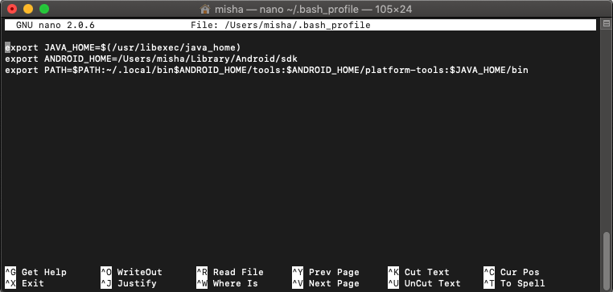

To save changes to the file hit *Control + X*, type *y* and hit *Enter*. **Important**, finish current terminal promt session (close all terminal windows) and start a new one, so changes to `.bash_profile` are in sync.

Install **carthage** using *homebrew*:

```shell
$ brew install carthage
```

Run `appium-doctor` again, everything should be green now.

