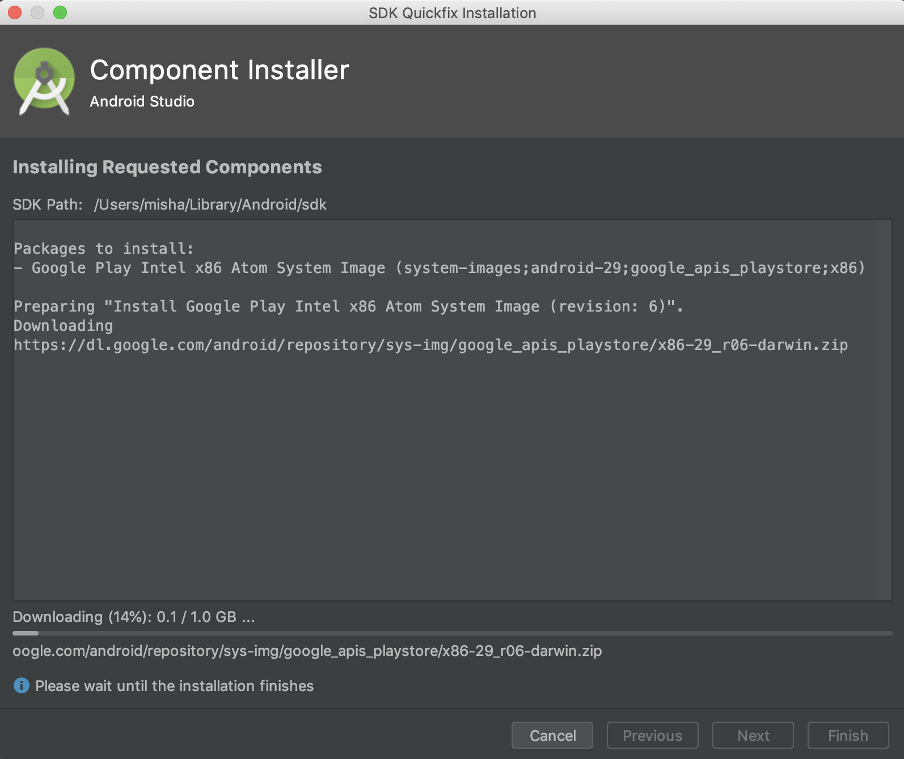
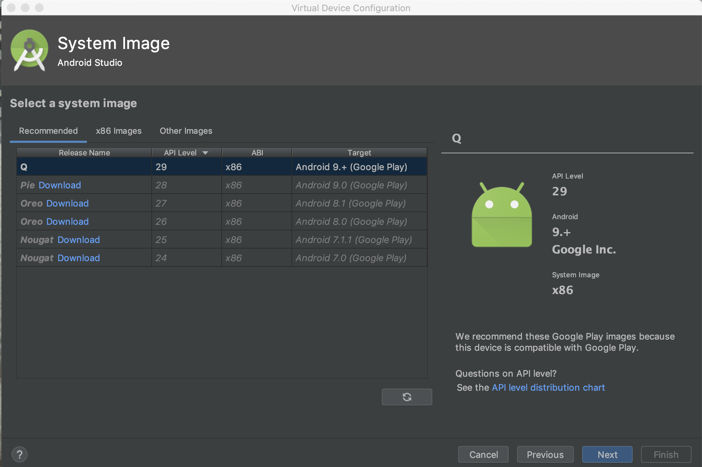
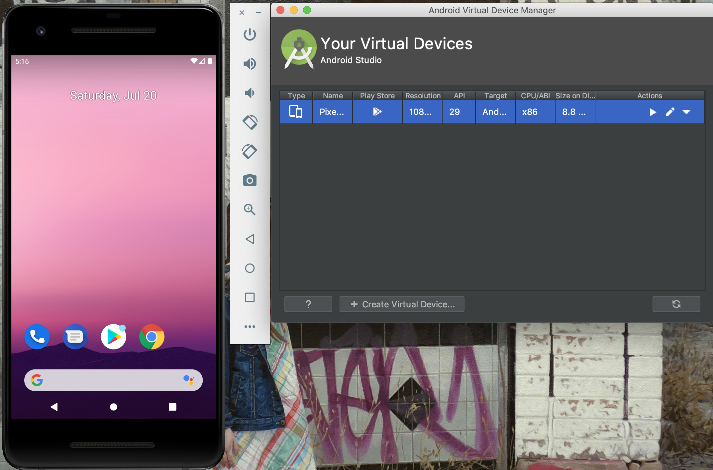

# Appium instalation instructions for Windows users

1. jdk
2. android sdk
3. avd
4. appium


## 1. jdk

The **Java Development Kit** is an implementation of either one of the Java Platform, Standard Edition, Java Platform, Enterprise Edition, or Java Platform, Micro Edition platforms released by Oracle Corporation in the form of a binary product aimed at Java developers on Solaris, Linux, macOS or Windows.

Hopefully, you have already installed JDK, open the terminal and run the command:

```shell
$ java --version
```

You should get something similar to:

```bash
java ~your-java-version~ 2018-07-17
Java(TM) SE Runtime Environment 18.3 (build 10.0.2+13)
Java HotSpot(TM) 64-Bit Server VM 18.3 (build 10.0.2+13, mixed mode)
```

Otherwise, proceed to this [page](https://www.oracle.com/technetwork/java/javase/downloads/jdk8-downloads-2133151.html) and look for a *Windows* distribution, don't forget to accept license agreement! Follow instalation instructions and get `java —version` going. 

## 2. android sdk

Download Android Studio from [here](https://developer.android.com/studio?pkg=studio), might take a while, installer quite bulky. Open installer and follow instalation instructions. Outcome of instalation process should be: 

Set environment variable `ANDROID_HOME` to the place where you've installed Android SDK, add *%ANDROID_HOME%\platform-tools* and *%ANDROID_HOME\tools%* to the Path variable under System Variables.

## 3. avd

Open **Android Studio** click on *Configure* and select *AVD Manager*:


Click at *Create Virtual Device*:


Go with *Pixel 2* and hit *Next*:


Download Android *Q* os image by clicking at *Download* link and following instalation instructions:




Now it's a time to create an emulator, select Android *Q* os image and hit next:



Rename AND so the name doesn't contain spaces and click *Next*:


Run emulator by clicking play button:



## 4. appium

**appium** is an open source test automation framework for use with native, [hybrid](http://appium.io/docs/en/writing-running-appium/web/hybrid/) and mobile web apps. It drives iOS, Android, and Windows apps using the WebDriver protocol.

Go [here](https://github.com/appium/appium-desktop/releases), pick the latest stable release, download windows distribution and follow instalation instructions.


You don't have to install `node`, you can get it from installed bundle, just add `C:\AppiumForWindows\node_modules\appium\bin` to the *Path* environment variable (similarly to what happened in stem 2)

To ensure proper Appium installatiom, run `node Appium-doctor`, everything should be green.

